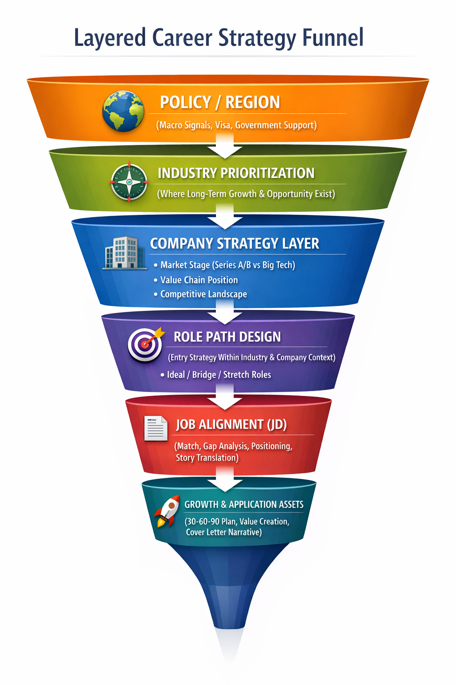

# 🚀 Layered Progressive Career Strategy System

An AI-powered career decision system for Data & AI roles —  
designed to guide users from **macro opportunity → industry → company strategy → job → growth**,  
instead of starting directly from job applications.

---

## 🔻 Career Strategy Funnel

  

---

## 💡 What This Project Does

Most job search tools start from **resumes and job postings**.

This system takes a fundamentally different approach:

> Start from **where opportunity exists**, then move down to execution.

It helps answer:

- 🌍 Which **regions and policies** support long-term opportunities?
- 🧭 Which **industries** are worth entering?
- 🏢 What **types of companies** should you target (not just names)?
- 🎯 What **role path** makes sense given your background?
- 📄 How to **align your experience with a specific job (JD)**?
- 🚀 How to build a **growth plan and compelling application narrative**?

---

## 🧠 Core Philosophy

This system follows a **top-down decision framework**:

Policy / Region
↓
Industry Prioritization
↓
Company Strategy
↓
Role Path Design
↓
Job Alignment (JD)
↓
Growth & Application Assets

Unlike traditional tools, this system focuses on:

- **Industry-first decision making**
- **Company strategy over company lists**
- **Positioning & value creation (not just matching)**
- **Long-term career growth, not just short-term offers**

---

## ⚙️ System Architecture (High-Level)

- **Policy Engine** → Macro signals, visa constraints, regional opportunities  
- **Industry Engine** → Industry scoring (growth, fit, entry feasibility)  
- **Company Strategy Engine** → Market, stage, value chain, competitors  
- **Role Path Engine** → Ideal / bridge / stretch roles  
- **Job Targeting Engine** → JD analysis, alignment, gap, positioning  
- **Growth Engine** → 30-60-90 plan, value creation, narrative  

---

## 🚧 Current Status

This project is currently in **system design + prototype stage**:

- ✅ Policy & Industry layers implemented (rule-based + LLM-assisted)
- ⚠️ Role layer partially implemented
- 🚧 Company / Job / Growth layers under active development
- 🔄 Ongoing refactor toward schema-first + orchestrator architecture

---

## 🔮 Vision

To evolve into a **career decision intelligence system** that:

- Goes beyond job matching
- Helps users **choose the right industry and company**
- Translates experience into **market-valued positioning**
- Provides **actionable growth strategies**

---

## 📌 Why This Matters

Most job seekers focus on:

> “How do I get this job?”

This system asks a more important question:

> **“Where should I go — and how do I build a path that compounds over time?”**

Instead of optimizing for one offer,  
it helps you optimize for a **career trajectory**.