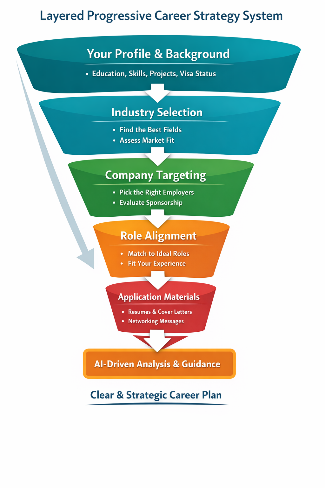
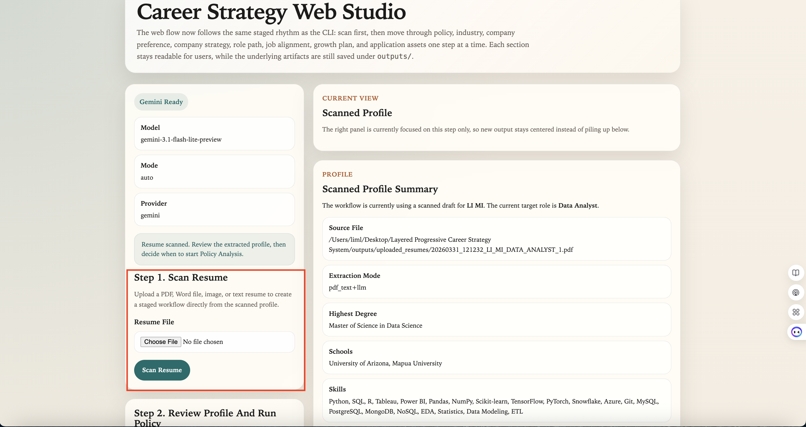
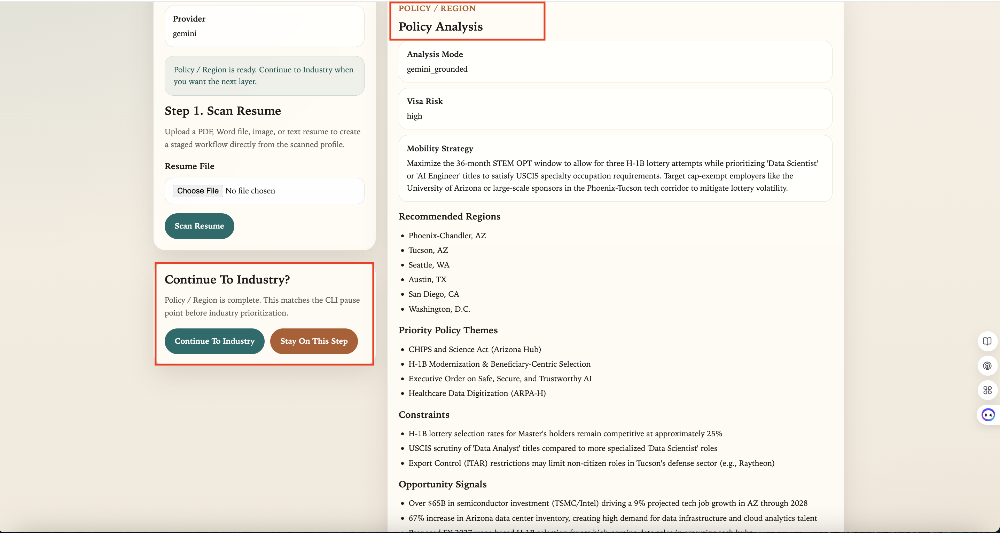
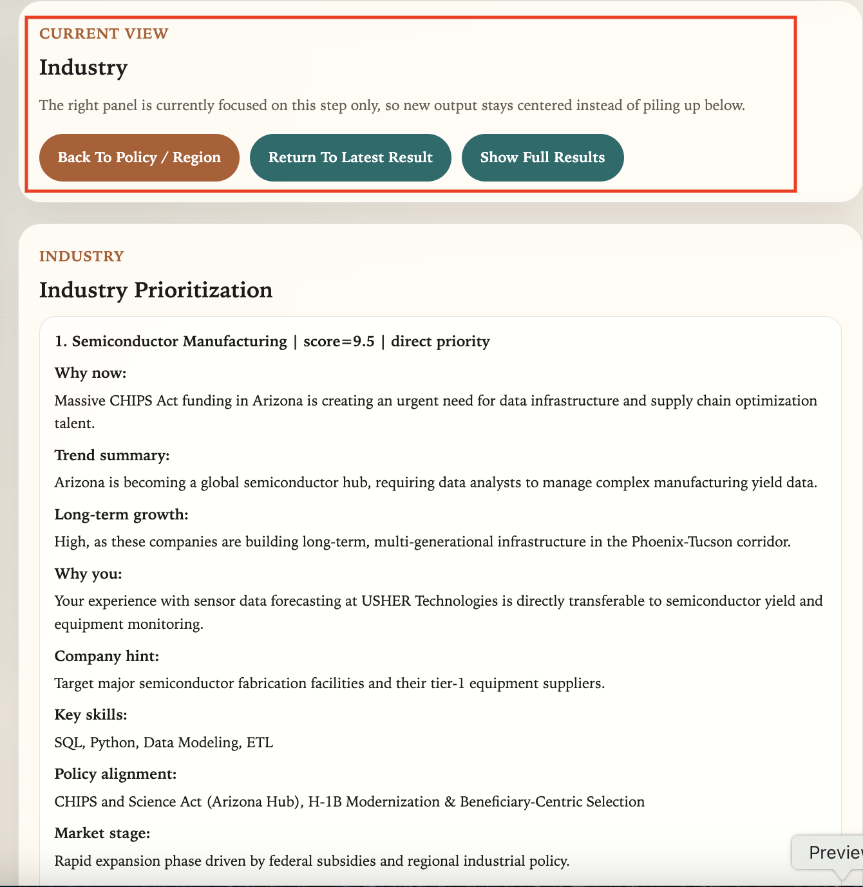
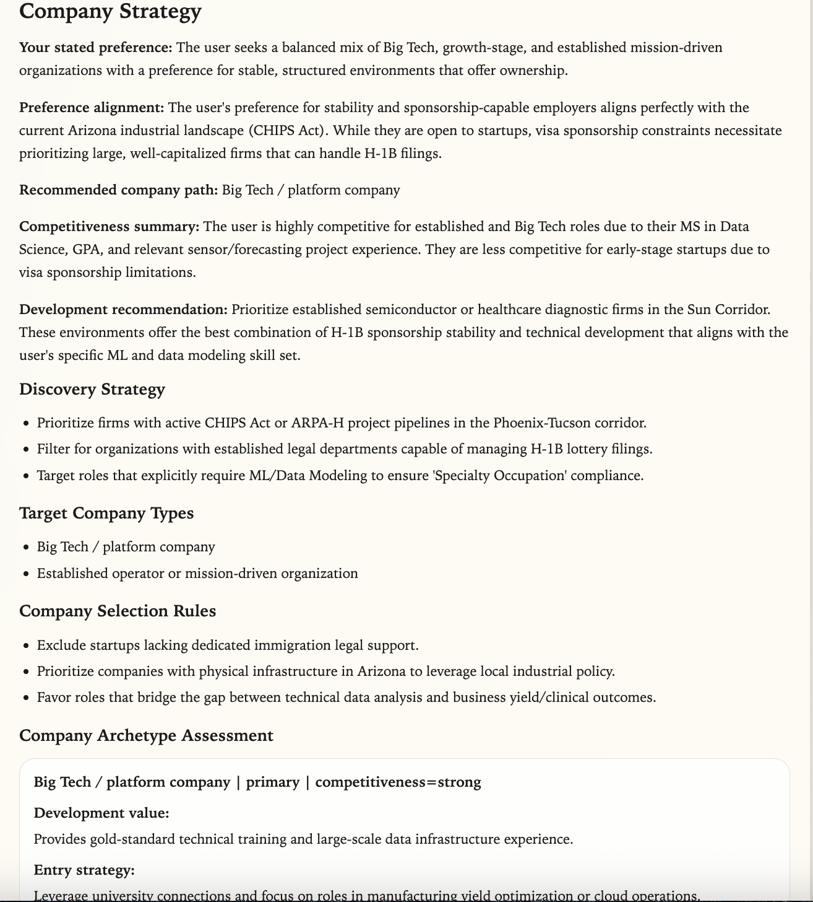
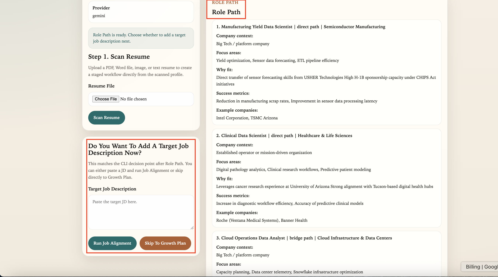
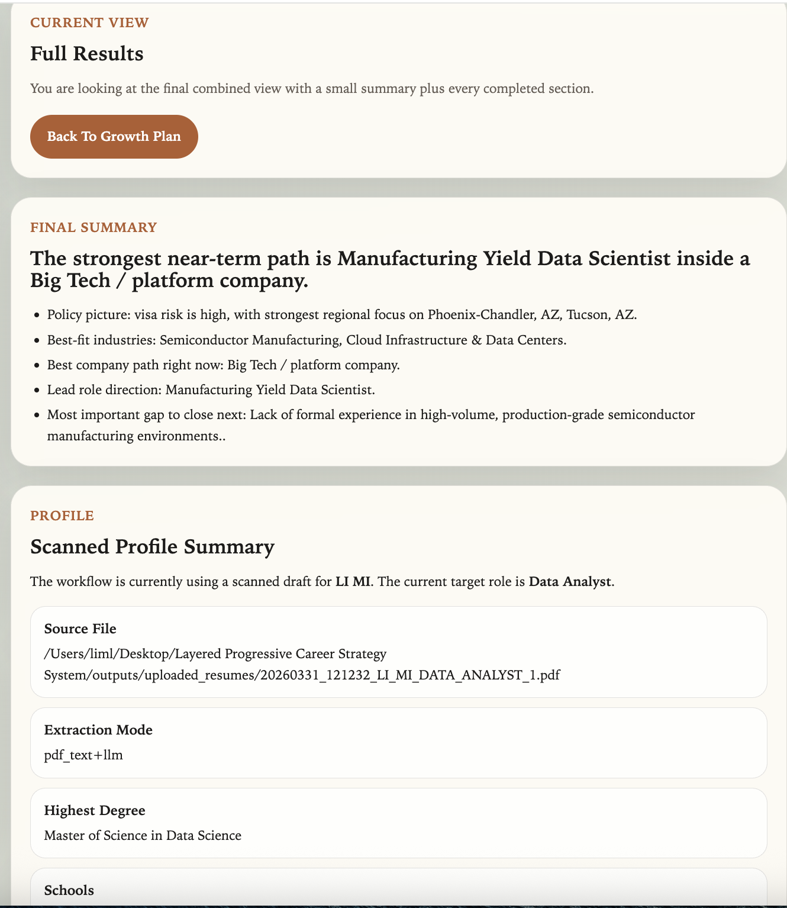

# 🚀 Layered Progressive Career Strategy System

An AI-powered career decision system for Data & AI roles —  
designed to guide users from **macro opportunity → industry → company strategy → job → growth**,  
instead of starting directly from job applications.

---

## Career Strategy Funnel

  

---

## What This Project Does

This project is a Layered Progressive Career Strategy System, built to feel like a smart career advisor that walks with you through every step of your job search. What makes it powerful is that every step is driven by a large language model, and each step connects to the next—so instead of random suggestions, you get a clear, continuous path. You start by telling the system about yourself—your education, skills, projects, and even real-world constraints like visa status. From there, the system thinks step by step: it helps you choose the right industries, points you to the kinds of companies you should focus on, matches you with realistic roles, and even helps you prepare resumes, cover letters, and networking messages. Along the way, it explains why each decision makes sense, so you’re not just following advice—you’re learning how to think strategically about your career. In simple terms, this isn’t just a tool to find jobs; it’s a complete AI-powered career planning journey where every part is connected, helping you go from feeling unsure to having a clear, confident plan.

---

## Output Sample

### 1. Resume Scan

### 2. Policy Analysis

### 3. Industry Prioritization

### 4. Company Strategy

### 5. Role Path And Job Step

### 6. Full Results

